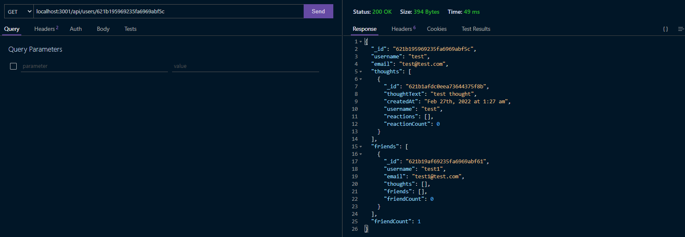

# Social-Network-API

## Description

This is a simple application to use Mongoose with node js to connect to mongo database and access REST apis. This is an application to utilize a social api command with to create, edit and delete users and friends as well as add thoughts and reactions.
Techonologies: MVC structure, nodejs, express, MongoDB, Mongoose.

## Application

 

## Table of Contents

- [Installation](#installation)
- [Usage](#usage)
- [Credits](#credits)
- [License](#license)
- [Contribute](#contributions)
- [Tests](#tests)
- [Questions](#questions)

## Installation

This is for local install if you want to deploy the appliaction yourself

1. clone repo on github
2. Install any required dependancies

```
    npm install
```

3. Start the application on nodeJS

```
    npm start
```

## Usage

1. Once the application is started access the api endpoints with localhost:3001/api
2. User Endpoints:
 - localhost:3001/api/users 
    - GET: list all users
    - POST: create a user
 - localhost:3001/api/users/:userdId
    - GET: get a user by id
    - DELETE: delete a single user
    - PUT: update a single user 
3. Friend Endpoints:
 - localhost:3001/api/users/:userId/friends/:friendId 
    - POST: add a friend to friends list for a single user
    - DELETE: remove a friend from firends list for a single user
4. Thoughts Endpoints: 
 - localhost:3001/api/thoughts
    - GET: get all thoughts 
    - POST: Create a new thought and add to user
 - localhost:3001/api/thoughts/:thoughtId
    - GET: get a single thought by Id
    - PUT: update a single thought by Id
    - DELETE: delete a single thought by Id
5. Reaction Endpoints:
 - localhost:3001/api/thoughts/:thoughtId/reactions
    - POST: create a reaction from a single thought
 - localhost:3001/api/thoughts/:thoughtId/reactions/:reactionId
    - DELETE: delete a reaction by Id


   

## Credits

N/A

## License

This application is under the MIT License  
For more information please view here: [MIT Description](https://choosealicense.com/licenses/mit/)

[](https://opensource.org/licenses/MIT)

## Contributions

Feel free to clone and improve on this application!

## Tests

[Demo Video](https://watch.screencastify.com/v/4vRBbrvRmK1lbjJbBTMd)

## Questions

See more about my Github here: [Fchoi1](https://www.github.com/Fchoi1)  
Any burning questions you want to ask me?  
Reach out to me! [fwchoi@uwaterloo.ca](mailto:fwchoi@uwaterloo.ca)
